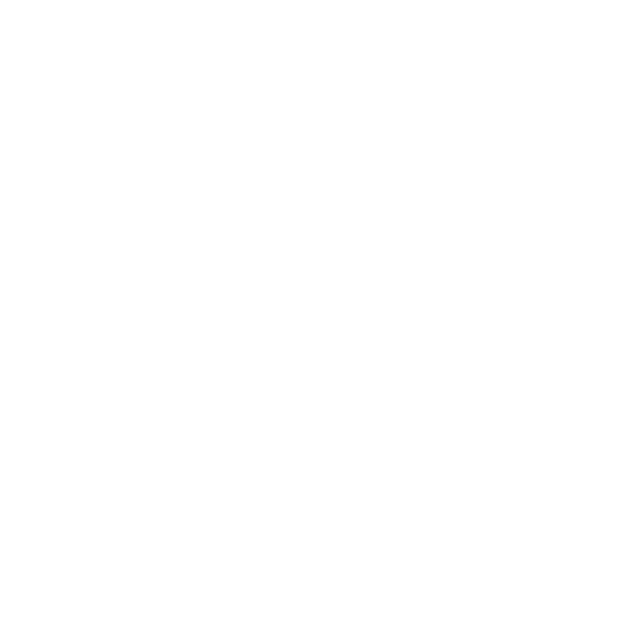
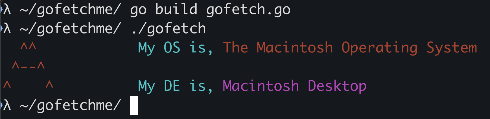

# gofetchme!
### a highly compact and <i><u>fast</u></i> fetch tool

<b>the first time opening will take a second but thats because you computer is storing and allocating the bytes.</b>

## Usage
> [!NOTE]
> This is a three step process

<b>keep in <i>mind</i> that you may want to move the compiled file to your root dir.</b>

###
<u><b>you will need the go compiler...</b></u>

###
<b>compile with the following ::</b>
```
go build gofetch.go
```
<b>now run the compiled `exec` with ::</b>
```
./gofetch
```

###
<b>make it a command by pasting the following into either the `.bashrc` or `.zshrc` file.</b>
```
alias gofetch='$HOME/gofetchme/./gofetch'
```