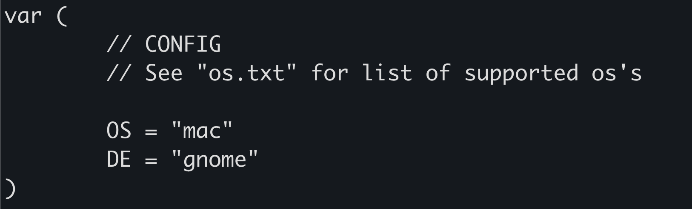

# How to `config`

first run this:
```
cd ~
cd gofetchme
cat os.txt
```
this will preview a list of all the currently supported os's

next run:
```
cd ~
cd gofetchme
cat de.txt
```
this will preview a list of all the currently supported de's

Now its time to enter <b>The FILE</b>
```
cd ~
cd gofetchme
nano gofetch.go
```
you will see a screen that looks like this:



now change `OS` to the os of your choice
and `DE` to the de of your choice

Now Learn to recompile here:
<a href="../docs/easy-compile.md">Recompile Tutorial</a>